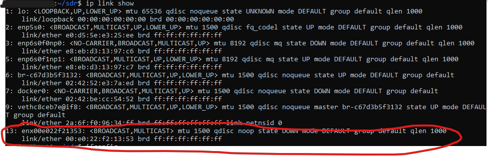
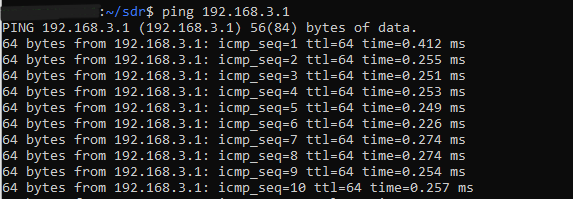

# Setting up PlutoSDR on ubuntu Server

Pluto SDR doesnt automatically connect to ubuntu server as it is a USB device that emulates an ethernet conenction, and ubuntu server does not let USB devices install themselves automatically.

 

To get it set up, first verify the pluto is connected via **lsusb**:

```javascript
lsusb
```

 

With the pluto plugged in run:

```javascript
ip link show
```

Take note of what is shown.

Unplug the pluto then run it again. Note what is missing.

```javascript
ip link show
```

Plug it in again then run it one more time to see the new connection

```javascript
ip link show
```

Note the name of the interface - in this case **enx00e022f21353**

  

Manually set ifconfig for **enx00e022f21353**.

```javascript
sudo ifconfig enx00e022f21353 192.168.3.2 netmask 255.255.255.0 up
```

Make special note to use the same IP subnet of your pluto (this one is set to the default of 192.168.3.1, so any IP on 192.168.3.x will do).

 

run ifconfig to see that the new interface exists.

```javascript
ifconfig
```

 

test with a ping

```javascript
ping 192.168.3.1
```

if it returns a result, you are good to go!

 

 

 
NOTE, this method will NOT persist across reboots. To do that, do the following method:


```javascript
sudo nano /etc/netplan/02-usb-device.yaml
```
add these contents:
 

```javascript
network:
  version: 2
  renderer: networkd
  ethernets:
    enx00e022f21353:  # use your correct interface name here
      dhcp4: no
      addresses: [192.168.3.2/24]
```

 

```javascript
sudo netplan apply
```

```javascript
ping 192.168.3.1
```

 